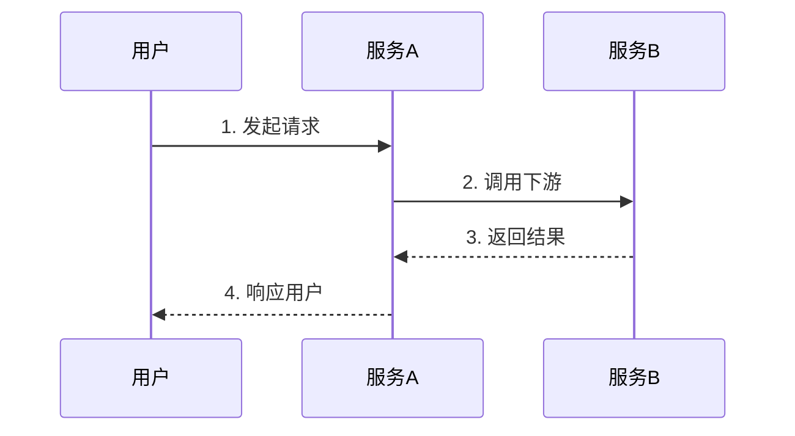

<!--
模板：flow（业务流程 SOP）
位置：.knowledge/flows/{slug}.md
层级：L2（执行编排——SOP）
必填段：TL;DR / 触发条件 / 主流程步骤 / 异常分支
质量门禁：主流程步骤必须编号；异常分支至少列出 1 条

填写指南：
- 步骤中每次调用具体接口/服务时，用 [[api-slug]] 引用 L3 接口文档
- 涉及业务规则的判断节点，用 [[bizrule-slug]] 引用 L2 规则文档
- 复杂流程优先用 mermaid sequenceDiagram，简单流程用编号列表
-->
---
title: {流程名称}                              # 例：配送下单完整流程
type: flow
tags: [{3-5 个标签}]
owner: "@{mis-id}"
created: {YYYY-MM-DD}
expires: {YYYY-MM-DD}                          # 默认 90 天
status: draft
sources:
  - "{来源描述}"
related:
  - "[[{关联术语 slug}]]"
  - "[[{关联接口 slug}]]"
---

## TL;DR

{50-100 词，"什么时候触发 + 核心步骤 + 终态"}

## 触发条件

{什么场景/事件会进入这个流程？谁触发？}

- 触发方：{用户 / 上游系统 / 定时任务 / MQ}
- 触发动作：{具体行为}

## 前置条件（可选）

- [ ] 条件 1：{必须满足的状态}
- [ ] 条件 2：...

## 主流程步骤

1. **{步骤名}** — {详细动作}
   - 调用：[[{api-slug}]]
   - 输入：{关键参数}
   - 输出：{关键产出}
   - 状态变更：{业务对象状态从 X → Y}

2. **{步骤名}** — {详细动作}
   - 调用：...
   - 业务规则：[[{bizrule-slug}]]

3. **{步骤名}** — {详细动作}

## 异常分支

| 异常场景 | 触发条件 | 处理方式 | 是否需人工 |
|---------|---------|---------|-----------|
| {场景 1} | {触发条件} | {补偿/重试/降级} | 否 |
| {场景 2} | {触发条件} | {人工介入} | 是 |

## 人工介入节点（可选）

### 节点：{步骤 N — 名称}
- **触发条件**：{什么情况转人工}
- **操作人**：{角色}
- **操作内容**：{需要做什么}
- **超时处理**：{超过 X 分钟未处理的兜底}

## 关联事故（可选）

- [[{incident-slug}]]：{该事故对本流程的启示}

