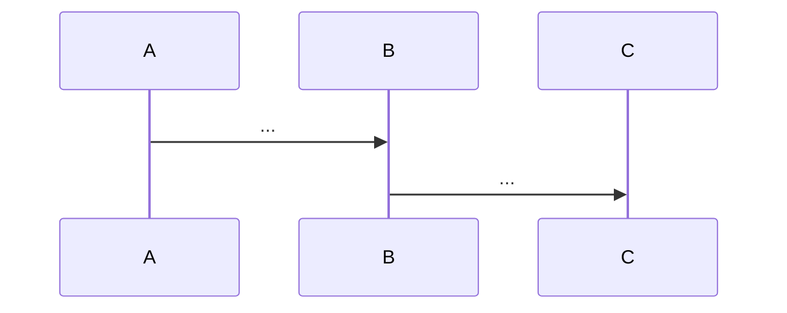

<!--
模板：solution（技术方案）
位置：.knowledge/design/{slug}.md
层级：L2（执行编排——某需求的时间点快照）
必填段：TL;DR / 背景与目标 / 方案设计 / 影响面
质量门禁：影响面必须列出涉及服务/接口/数据表

填写指南：
- 与 architecture 的区别：solution 是"针对某需求的快照"，不会持续更新
- 与 adr 的区别：solution 描述"怎么做"，adr 强调"为什么这样选"
- 上线后归档保留即可，不需要长期维护
-->
---
title: {方案名称}                              # 例：配送发单重构方案
type: solution
tags: [{3-5 个标签}]
owner: "@{mis-id}"
created: {YYYY-MM-DD}
expires: {YYYY-MM-DD}                          # 默认 90 天，需求关闭后可标 deprecated
status: draft
sources:
  - "{来源：PRD / 飞书文档 URL / 评审纪要}"
related:
  - "[[{关联需求 slug}]]"
  - "[[{关联架构 slug}]]"
---

## TL;DR

{50-100 词，"做什么 + 核心方案特征 + 期望收益"}

## 背景与目标

### 背景
{为什么要做这件事？现状有什么问题？}

### 目标
- 业务目标：{用业务指标描述}
- 技术目标：{用技术指标描述}

## 方案设计

### 总体思路
{一句话概括方案的核心逻辑}

### 详细设计
1. {步骤 1：改造点描述}
2. {步骤 2：改造点描述}
3. ...

### 核心流程

## 影响面

| 类别 | 范围 | 说明 |
|------|------|------|
| 涉及服务 | {service-1, service-2} | {改动概要} |
| 涉及接口 | {api-1, api-2} | {新增/修改/废弃} |
| 涉及数据表 | {table-1.field-x} | {新增字段/迁移} |
| 涉及配置 | {config-key} | {Lion / 环境变量} |

## 备选方案对比（可选）

| 维度 | 方案 A（采纳） | 方案 B | 方案 C |
|------|--------------|-------|-------|
| 复杂度 | 中 | 高 | 低 |
| 风险 | 低 | 中 | 低 |
| 可扩展性 | 高 | 高 | 低 |

## 风险与回滚（可选）

- 风险点 1：... → 缓解措施：...
- 回滚方案：{开关 / 版本回退 / 数据兼容策略}

## 上线计划（可选）

| 阶段 | 时间 | 动作 |
|------|------|------|
| 灰度 | {日期} | {范围} |
| 全量 | {日期} | — |

